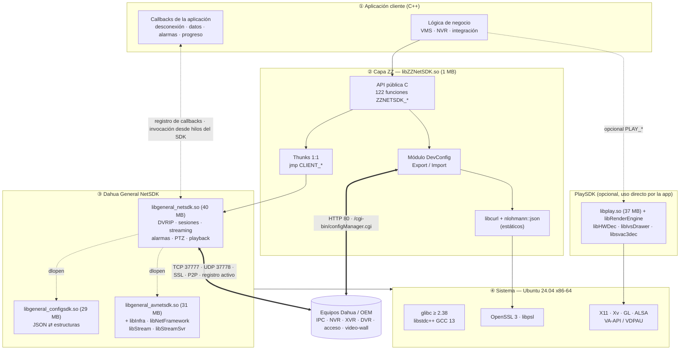
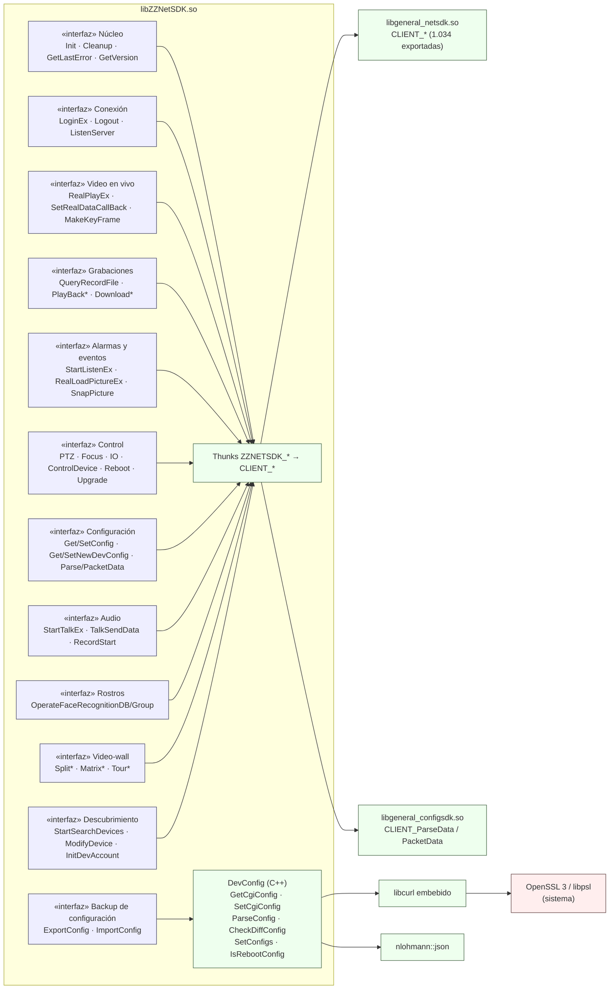
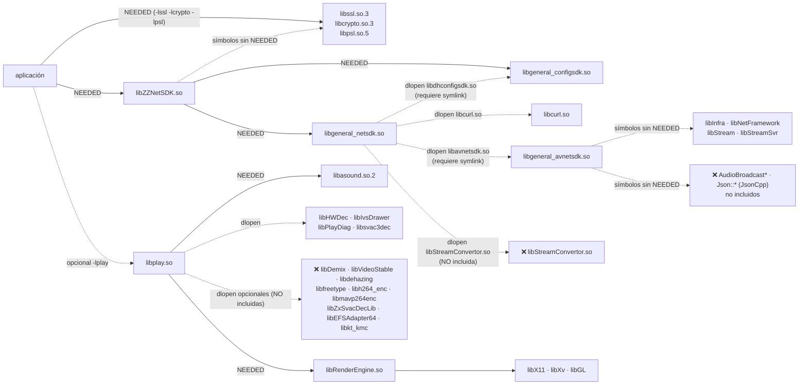
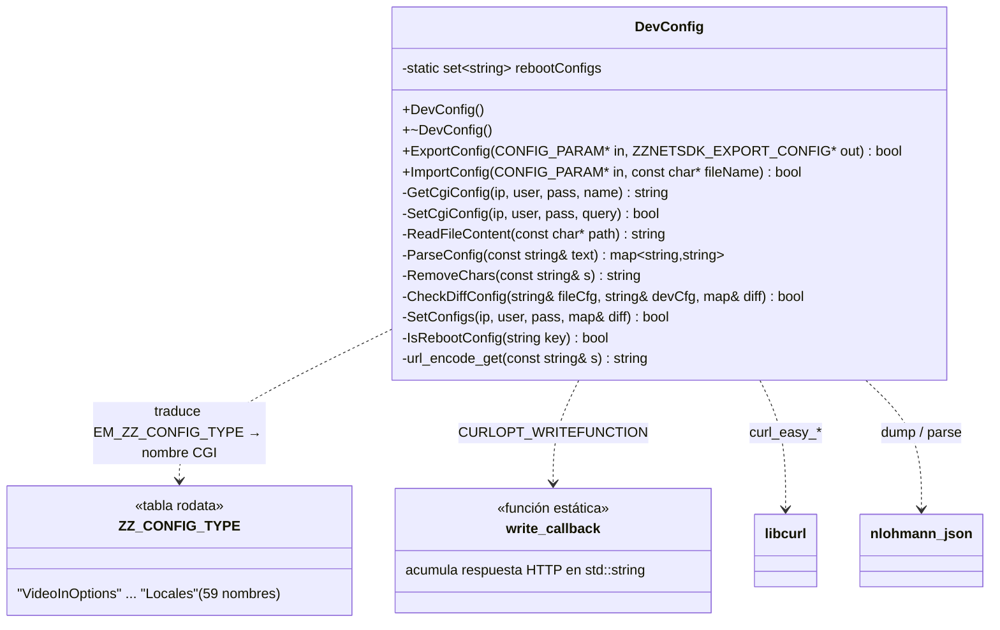
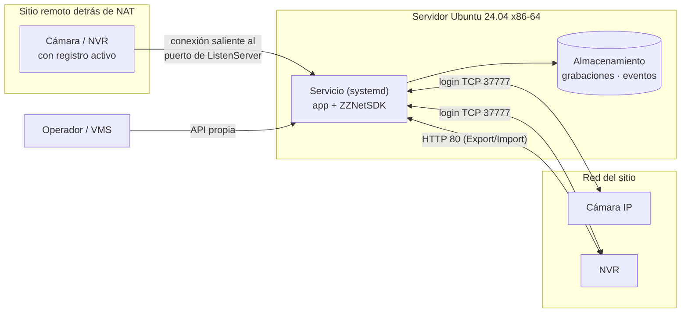

# 3. Arquitectura y componentes

[← Índice](README.md)

## 3.1 Vista general

ZZNetSDK es una arquitectura en capas en la que la aplicación sólo ve la API `ZZNETSDK_*`. Casi toda la funcionalidad reside en el **Dahua General NetSDK**; la capa ZZ es una fachada de re-branding con un módulo propio de exportación/importación de configuración.



## 3.2 Diagrama de componentes



## 3.3 Inventario de bibliotecas

| Biblioteca | Tamaño | Origen | Función | Cómo se carga |
|---|---|---|---|---|
| `libZZNetSDK.so` | 1,0 MB | Integrador (ZZ) | Fachada pública + DevConfig + libcurl + nlohmann/json | Enlazada por la aplicación |
| `libgeneral_netsdk.so` | 40,5 MB | Dahua | Núcleo NetSDK: 1.034 funciones `CLIENT_*`, protocolo privado, streaming, alarmas | `NEEDED` de libZZNetSDK |
| `libgeneral_configsdk.so` | 29,2 MB | Dahua | ConfigSDK: conversión JSON ⇄ estructuras (`CLIENT_ParseData`/`PacketData`) | `NEEDED` de libZZNetSDK + `dlopen("libdhconfigsdk.so")` desde netsdk |
| `libgeneral_avnetsdk.so` | 31,1 MB | Dahua | AVNetSDK (protocolos RTSP/AV de nueva generación) | `dlopen("libavnetsdk.so")` desde netsdk |
| `libInfra.so` | 3,1 MB | Dahua | Infraestructura: hilos, tiempo, memoria (`Dahua::Infra`) | Requerida por avnetsdk (sin `NEEDED`) |
| `libNetFramework.so` | 1,1 MB | Dahua | Framework de red (`Dahua::NetFramework`: sockets, hilos de red) | Requerida por avnetsdk |
| `libStream.so` | 1,2 MB | Dahua | Tramas de medios (`Dahua::Stream`) | Requerida por avnetsdk |
| `libStreamSvr.so` | 4,9 MB | Dahua | RTSP/RTP cliente (`Dahua::StreamSvr`) | Requerida por avnetsdk |
| `libcurl.so` / `.so.4` | 3,5 MB | libcurl (OpenSSL estático) | HTTP para netsdk | `dlopen("libcurl.so")` desde netsdk |
| `libplay.so` | 37,2 MB | Dahua PlaySDK | Demux/decodificación H.264/H.265/SVAC, render, audio (331 funciones `PLAY_*`) | Opcional, enlazada por la app |
| `libRenderEngine.so` | 4,5 MB | Dahua | Render OpenGL/Xv | `NEEDED` de libplay |
| `libHWDec.so` | 0,4 MB | Dahua | Decodificación por hardware (VA-API/VDPAU) | Cargada por libplay |
| `libIvsDrawer.so` | 2,6 MB | Dahua | Dibujo de reglas/objetos IVS sobre el video | Cargada por libplay |
| `libPlayDiag.so` | 65 KB | Dahua | Diagnóstico de reproducción | Cargada por libplay/render |
| `libsvac3dec.so` | 0,5 MB | Terceros | Decodificador SVAC 3 (estándar chino) | Cargada por libplay |

Archivos de configuración:

| Archivo | Lo usa | Contenido |
|---|---|---|
| `PlayConfig.ini` | libplay.so | `loglevel` (1-6), `inputdata` (volcar `.dav`), `enablevadecode=1` (VA-API), diagnóstico gráfico |
| `audio_aec_ans_16k.cfg` | libplay.so (audio) | Cancelación de eco (AEC), supresión de ruido (ANS), AGC a 16 kHz mono 16 bits |
| `JudgeHW.sh` | Manual | Script que detecta VA-API/VDPAU y crea enlaces `libHWDec.so` (incompleto en este paquete) |

## 3.4 Grafo de dependencias en tiempo de carga

Obtenido con `readelf -d` (enlaces `NEEDED`), `strings` + `LD_DEBUG=files` (cargas `dlopen`) y `ldd -r` (símbolos no resueltos).



Resultado de la prueba con `LD_DEBUG=files` durante `ZZNETSDK_StartSearchDevices`:

```text
file=libcurl.so        dynamically loaded by libgeneral_netsdk.so   -> OK (con LD_LIBRARY_PATH)
file=libavnetsdk.so    dynamically loaded by libgeneral_netsdk.so   -> OK con symlink, luego:
   error: symbol lookup error: undefined symbol: _ZN5Dahua12NetFramework11CNetHandler5CloseEv
file=libdhconfigsdk.so dynamically loaded by libgeneral_netsdk.so   -> OK con symlink
```

## 3.5 Mapeo interno ZZ → Dahua

El desensamblado muestra que **119 de las 122 funciones** son "trampolines" de 9-12 bytes que saltan directamente a la función `CLIENT_*` equivalente (algunas sólo extienden a 16 bits un `WORD`). Ejemplos reales:

```asm
ZZNETSDK_Init:            endbr64
                          xor  %edx,%edx          ; lpInitParam = NULL
                          jmp  CLIENT_InitEx
ZZNETSDK_LoginEx:         endbr64
                          movzwl %si,%esi         ; WORD wDVRPort -> int
                          jmp  CLIENT_LoginEx
ZZNETSDK_RealPlayEx:      endbr64
                          jmp  CLIENT_RealPlayEx
ZZNETSDK_GetVersion:      lea  "1.1.1.3"(%rip),%rax
                          ret
```

| Función ZZ | Implementación real |
|---|---|
| `ZZNETSDK_Init(cb, dwUser)` | `CLIENT_InitEx(cb, dwUser, NULL)` |
| `ZZNETSDK_ZZPTZControlEx` / `Ex2` | `CLIENT_DHPTZControlEx` / `CLIENT_DHPTZControlEx2` |
| `ZZNETSDK_SnapPicture(par)` | Copia `ZZSNAP_PARAMS` por valor (poniendo `Reserved` en 0) y llama `CLIENT_SnapPicture` |
| `ZZNETSDK_GetVersion()` | Constante `"1.1.1.3"` (versión de la fachada, no del NetSDK) |
| `ZZNETSDK_ExportConfig` / `ImportConfig` | Clase propia `DevConfig` (HTTP CGI + JSON) |
| Resto (117) | `CLIENT_<mismo nombre>` con los mismos parámetros |

**Consecuencia de diseño:** las estructuras `ZZ*`/`ZZNET_*` se pasan **sin conversión** al NetSDK. Son, por lo tanto, copias binariamente compatibles de las estructuras `NET_*`/`DH_*` de Dahua. Los comentarios de `ZZGlobal.h` referencian a veces nombres Dahua (`NET_SNAP_MODE`, `CFG_RECORD_INFO`, ...), lo que confirma el origen. Toda la documentación y ejemplos del NetSDK de Dahua aplican cambiando `CLIENT_` por `ZZNETSDK_` y `NET_`/`DH_` por `ZZNET_`/`ZZ_`.

## 3.6 Módulo propio: `DevConfig`

Reconstruido a partir de los símbolos C++ (no *strippeados*) y del desensamblado:



Parámetros de libcurl observados en el desensamblado:

| Opción | `GetCgiConfig` | `SetCgiConfig` |
|---|---|---|
| URL | `http://<szIP>/cgi-bin/configManager.cgi?action=getConfig&name=<Nombre>` | `http://<szIP>/cgi-bin/configManager.cgi?action=setConfig&<Clave>=<Valor>&...` |
| `CURLOPT_HTTPAUTH` | `1` = **CURLAUTH_BASIC** | `1` = **CURLAUTH_BASIC** |
| `CURLOPT_USERPWD` | `usuario:contraseña` | `usuario:contraseña` |
| `CURLOPT_CONNECTTIMEOUT` | 2 s | 20 s |
| `CURLOPT_TIMEOUT` | 7 s | 10 s |
| Verifica código HTTP | — | `CURLINFO_RESPONSE_CODE` |

Claves consideradas "de reinicio" (`rebootConfigs`), que se envían al final en `ImportConfig`: `Https.Enable`, `Https.Port`, `Web.Port`, `DVRIP.TCPPort`, `DVRIP.UDPPort`, `VideoStandard`.

## 3.7 Modelo de ejecución e hilos

- `ZZNETSDK_Init` levanta **14 hilos** internos (medido): E/S de red, keep-alive, despacho de callbacks, temporizadores.
- **Todos los callbacks se ejecutan en hilos del SDK**, no en el hilo que llamó. Deben ser rápidos, no bloquear y proteger datos compartidos con mutex. Los encabezados advierten explícitamente: *"DO NOT call ZZ_CTRL_ALARM_ACK within the alarm callback interface"* — en general, **no llamar funciones del SDK desde dentro de un callback**; encolar el trabajo y procesarlo en otro hilo.
- Los buffers entregados en callbacks (`pBuffer`, `pBuf`) pertenecen al SDK y sólo son válidos durante la llamada: copiar si se necesitan después.
- `ZZNETSDK_StartSearchDevices` y `ZZNETSDK_ModifyDevice` están documentadas como **no seguras para llamadas multi-hilo**.

## 3.8 Modelo de despliegue típico


