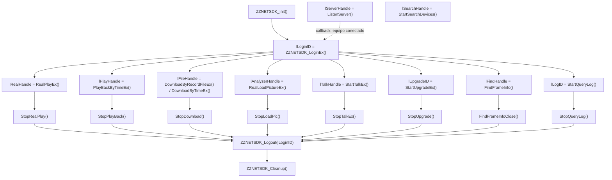

# 4. Funcionalidades y referencia de la API

[← Índice](README.md)

## 4.1 Conceptos fundamentales

### Convenciones de tipos (Linux x64)

Definidas en `ZZGlobal.h`:

| Tipo | Definición Linux | Uso |
|---|---|---|
| `BOOL` | `int` | `TRUE` (1) = éxito, `FALSE` (0) = error → consultar `ZZNETSDK_GetLastError()` |
| `LLONG` | `long` (64 bits) | **Handles**: login, reproducción, descarga, búsqueda, etc. `0` = inválido |
| `LDWORD` | `long` | Dato de usuario (`dwUser`) que se devuelve en los callbacks (útil para pasar `this`) |
| `LONG` | `int` (32 bits) | ⚠ en Linux es 32 bits, a diferencia de `long` |
| `DWORD` | `uint32_t` | Tamaños, tipos, tiempos de espera en ms |
| `WORD` | `unsigned short` | Puertos |
| `HWND` | `void*` | Ventana de render (usar `NULL` en servidores) |
| `CALLBACK`, `CALL_METHOD` | vacíos | Convención de llamada por defecto |
| `ZZNETSDK_API` | `extern "C"` | Exportación C sin *name mangling* |

### Modelo de handles



Reglas:

1. `ZZNETSDK_Init` **una sola vez** por proceso, antes de cualquier otra llamada; `ZZNETSDK_Cleanup` una vez al final.
2. Todo handle hijo se libera con su función `Stop*`/`Close*` **antes** del `Logout` del login padre.
3. Un handle `0` indica error; consultar `ZZNETSDK_GetLastError()` inmediatamente (el valor es por hilo *(inferido, comportamiento del NetSDK de Dahua)*).
4. La memoria de entrada/salida la **reserva y libera el usuario** (lo dicen los comentarios de casi todas las funciones). La de los callbacks la gestiona el SDK.
5. Muchas estructuras `ZZNET_IN_*` / `ZZNET_OUT_*` tienen un primer campo `dwSize` que debe inicializarse con `sizeof(estructura)`; si no, error `ZZNET_ERROR_PARAM_DWSIZE_ERROR` (`0x800001A7`).
6. Los parámetros `waittime`/`nWaitTime` son tiempos de espera en **milisegundos**. `ZZNET_INTERFACE_DEFAULT_TIMEOUT` = 3000 ms.

### Callbacks

| Tipo | Firma resumida | Se registra con | Se invoca cuando |
|---|---|---|---|
| `ffDisConnect` | `(lLoginID, ip, port, dwUser)` | `ZZNETSDK_Init` | Se pierde la conexión con un equipo |
| `fMessCallBack` | `BOOL (lCommand, lLoginID, pBuf, len, ip, port, dwUser)` | `SetDVRMessCallBack` | Llega una alarma (tras `StartListen[Ex]`) |
| `fMessCallBackEx1` | igual + `bAlarmAckFlag`, `nEventID` | `SetDVRMessCallBackEx1` | Alarma con posibilidad de *acknowledge* |
| `fSnapRev` | `(lLoginID, pBuf, len, EncodeType, CmdSerial, dwUser)` | `SetSnapRevCallBack` | Llega una captura pedida con `SnapPicture` (`EncodeType` 10 = JPEG) |
| `fServiceCallBack` | `int (lHandle, ip, port, lCommand, pParam, len, dwUser)` | `ListenServer` | Un equipo se registra (`lCommand=1`, `pParam`=nº de serie) o se desconecta (`-1`) |
| `fRealDataCallBack` | `(lRealHandle, dwDataType, pBuffer, size, dwUser)` | `SetRealDataCallBack` | Llega un bloque de video/audio en vivo (`dwDataType` 0 = flujo original) |
| `fDataCallBack` | `int (handle, dwDataType, pBuffer, size, dwUser)` | `PlayBackByTimeEx`, `Download*` | Datos de reproducción/descarga (0 = archivo original, 1 = flujo privado) |
| `fDownLoadPosCallBack` | `(handle, total, descargado, dwUser)` | `PlayBackByTimeEx`, `DownloadByRecordFileEx` | Progreso; `descargado == -1` fin, `-2` sin permiso |
| `ffTimeDownLoadPosCallBack` | `(handle, total, descargado, index, fileinfo, dwUser)` | `DownloadByTimeEx` | Progreso por archivo |
| `fAnalyzerDataCallBack` | `int (handle, dwAlarmType, pAlarmInfo, pBuffer, size, dwUser, nSeq, reserved)` | `RealLoadPictureEx` | Evento inteligente con imagen |
| `ffSearchDevicesCB` | `(ZZDEVICE_NET_INFO_EX*, pUserData)` | `StartSearchDevices`, `SearchDevicesByIPs` | Se descubre un equipo |
| `fUpgradeCallBack` | `(lLoginID, handle, total, enviado, dwUser)` | `StartUpgradeEx` | Progreso; `total=0,enviado=-1` fin, `-2` error, `-3` sin permiso |
| `pfAudioDataCallBack` | `(lTalkHandle, pData, size, byAudioFlag, dwUser)` | `StartTalkEx` | Audio local capturado (0) o recibido del equipo (1) |

---

## 4.2 Referencia por módulo

Las 122 funciones públicas agrupadas funcionalmente. Entre paréntesis, la función de Dahua a la que se delega.

### 4.2.1 Núcleo (4)

| Función | Descripción |
|---|---|
| `ZZNETSDK_Init(ffDisConnect cb, LDWORD dwUser)` | Inicializa el SDK y registra el callback global de desconexión (`CLIENT_InitEx(cb, dwUser, NULL)`). Crea los hilos internos |
| `ZZNETSDK_Cleanup()` | Libera todos los recursos. Llamar al final, tras cerrar todos los handles |
| `ZZNETSDK_GetLastError()` | Código de error de la última función fallida. Ver [06](06-codigos-error.md) |
| `ZZNETSDK_GetVersion()` | Devuelve la versión de la fachada: `"1.1.1.3"` (implementación propia) |

### 4.2.2 Callbacks globales (3)

| Función | Descripción |
|---|---|
| `ZZNETSDK_SetDVRMessCallBack(cb, dwUser)` | Callback único para todas las alarmas de todos los equipos |
| `ZZNETSDK_SetDVRMessCallBackEx1(cb, dwUser)` | Variante con `bAlarmAckFlag`/`nEventID` para confirmar alarmas (`ZZ_CTRL_ALARM_ACK` vía `ControlDevice`, **fuera** del callback) |
| `ZZNETSDK_SetSnapRevCallBack(cb, dwUser)` | Callback de recepción de capturas remotas |

### 4.2.3 Conexión y sesión (4)

| Función | Descripción |
|---|---|
| `ZZNETSDK_LoginEx(ip, port, user, pass, nSpecCap, pCapParam, lpDeviceInfo, *error)` | Inicia sesión. Devuelve `lLoginID`. `lpDeviceInfo` recibe nº de serie, cantidad de canales/entradas/salidas/discos y tipo de equipo |
| `ZZNETSDK_Logout(lLoginID)` | Cierra la sesión y libera sus recursos |
| `ZZNETSDK_ListenServer(ip, port, nTimeout, cb, dwUser)` | Inicia un servidor TCP para **registro activo** (el equipo se conecta al servidor, útil detrás de NAT). `nTimeout` se ignora |
| `ZZNETSDK_StopListenServer(lServerHandle)` | Detiene el servidor de registro activo |

Tipos de login (`nSpecCap`, enumeración `EM_ZZ_LOGIN_SPAC_CAP_TYPE`):

| Valor | Enumeración | Comentario en `ZZNetSDK.h` | `pCapParam` |
|---|---|---|---|
| 0 | `EM_ZZ_LOGIN_SPEC_CAP_TCP` | Login TCP (normal) | `NULL` |
| 1 | `..._ANY` | — | — |
| 2 | `..._SERVER_CONN` | Login de registro activo | ID/nº de serie del equipo registrado |
| 3 | `..._MULTICAST` | Multicast | `NULL` |
| 4 | `..._UDP` | UDP | `NULL` |
| 6 | `..._MAIN_CONN_ONLY` | Sólo conexión principal (sin sub-conexiones de video) | `NULL` |
| 7 | `..._SSL` | Cifrado SSL | `NULL` |
| 9 | `..._INTELLIGENT_BOX` | "Remote device login" | Nombre del equipo remoto |
| 10 | `..._NO_CONFIG` | — | — |
| 11 | `..._U_LOGIN` | — | — |
| 12 | `..._LDAP` | LDAP | `NULL` |
| 13 | `..._AD` | Active Directory | `NULL` |
| 14 | `..._RADIUS` | Radius | `NULL` |
| 15 | `..._SOCKET_5` | Proxy Socks5 | `"ipServidor&&puerto&&usuario&&clave"` |
| 16 | `..._CLOUD` | "Proxy login" | `SOCKET` ya conectado |
| 17 | `..._AUTH_TWICE` | — | — |
| 18 | `..._TS` | — | — |
| **19** | `EM_ZZ_LOGIN_SPEC_CAP_P2P` | **Login P2P** | `NULL` |
| 20 | `..._MOBILE` | Cliente móvil | `NULL` |

> Hay diferencias entre el comentario de la cabecera y el nombre de la enumeración para los valores 9 y 16; se documentan ambos. Ver [05 §5.11](05-flujos-secuencia.md) para el flujo P2P.

`ZZNET_DEVICEINFO` (salida de `LoginEx`):

| Campo | Tipo | Significado |
|---|---|---|
| `sSerialNumber[48]` | BYTE | Número de serie |
| `byAlarmInPortNum` / `byAlarmOutPortNum` | BYTE | Entradas/salidas de alarma |
| `byDiskNum` | BYTE | Cantidad de discos |
| `byDVRType` | BYTE | Tipo de equipo |
| `byChanNum` / `byLeftLogTimes` | BYTE (unión) | Canales de video; si falló por contraseña, intentos restantes |

> ⚠ Para equipos con más de 255 canales, esta estructura (heredada de `NET_DEVICEINFO`) se queda corta; usar `QueryDevState`/`QueryNewSystemInfo` para obtener la cantidad real.

### 4.2.4 Video en vivo (7)

| Función | Descripción |
|---|---|
| `ZZNETSDK_RealPlayEx(lLoginID, nChannelID, hWnd, rType)` | Abre un flujo en vivo. `rType`: `ZZ_RType_Realplay_0` (principal), `_1`/`_2`/`_3` (sub-flujos), `ZZ_RType_Multiplay_N` (mosaico en NVR), `ZZ_RType_Realplay_Test` (prueba de ancho de banda). **Por defecto `ZZ_RType_Multiplay`**: especificar siempre el tipo |
| `ZZNETSDK_SetRealDataCallBack(lRealHandle, cb, dwUser)` | Registra el callback que recibe los bloques del flujo (formato privado Dahua `.dav`, H.264/H.265 + audio) |
| `ZZNETSDK_MakeKeyFrame(lLoginID, nChannelID, nSubChannel)` | Fuerza un I-frame (útil al arrancar un decodificador) |
| `ZZNETSDK_SetRealplayBufferPolicy(lPlayHandle, ZZNET_IN_BUFFER_POLICY*, nWaitTime)` | Política de buffer: 0 por defecto, 1 fluidez, 2 tiempo real (baja latencia) |
| `ZZNETSDK_StopRealPlay(lRealHandle)` | Cierra el flujo |
| `ZZNETSDK_CapturePicture(hPlayHandle, archivo)` | Captura el cuadro actual de un flujo en vivo o reproducción a archivo (BMP) — requiere decodificación local |
| `ZZNETSDK_CapturePictureEx(hPlayHandle, archivo, eFormat)` | Igual, con formato `ZZNET_CAPTURE_BMP`, `_JPEG` (100 %), `_JPEG_70`, `_JPEG_50`, `_JPEG_30` |

### 4.2.5 Búsqueda de grabaciones (10)

| Función | Descripción |
|---|---|
| `ZZNETSDK_QueryRecordFile(lLoginID, canal, tipo, inicio, fin, cardid, pFileInfo[], maxlen, *count, waittime, bTime)` | Búsqueda **síncrona** de archivos grabados en un rango. `tipo` (`nRecordFileType`): 0 todos/normal, 1 alarma, 2 movimiento, 3 nº de tarjeta, 4 imagen, 5 inteligente, 19 POS, 255 todos. `maxlen` en bytes |
| `ZZNETSDK_StartQueryRecordFile(lLoginID, IN*, OUT*)` | Búsqueda **asíncrona** (resultado por `ffQueryRecordFileCallBack`) |
| `ZZNETSDK_QueryRecordStatus(lLoginID, canal, tipo, mes, cardid, ZZNET_RECORD_STATUS*, waittime)` | Mapa de días del mes con grabación (para calendarios) |
| `ZZNETSDK_QueryFurthestRecordTime(lLoginID, tipo, cardid, *, nWaitTime)` | Fecha de la grabación más antigua por canal |
| `ZZNETSDK_FindFrameInfo(lLoginID, IN*, OUT*, nWaitTime)` | Inicia búsqueda de información de tramas dentro de un archivo (devuelve `lFindHandle`) |
| `ZZNETSDK_FindNextFrameInfo(lFindHandle, IN*, OUT*, nWaitTime)` | Obtiene el siguiente lote |
| `ZZNETSDK_FindFrameInfoClose(lFindHandle)` | Cierra la búsqueda |
| `ZZNETSDK_FileStreamSetTags` / `ZZNETSDK_FileStreamGetTags` / `ZZNETSDK_FileStreamClearTags` | Marca, lee y borra etiquetas (bookmarks) en un flujo de archivo |

`ZZNET_RECORDFILE_INFO`: `ch`, `filename[124]`, `framenum`, `size` (KB), `starttime`, `endtime`, `driveno`, `startcluster`, `nRecordFileType`, `bImportantRecID`, `bHint`, `bRecType` (0 principal, 1-3 sub-flujos).

`ZZNET_TIME`: `dwYear`, `dwMonth`, `dwDay`, `dwHour`, `dwMinute`, `dwSecond` (hora local del equipo).

### 4.2.6 Reproducción remota (7)

| Función | Descripción |
|---|---|
| `ZZNETSDK_PlayBackByTimeEx(lLoginID, canal, inicio, fin, hWnd, cbPos, dwPosUser, cbData, dwDataUser)` | Reproduce por rango de tiempo. Con `hWnd=NULL` los datos llegan por `cbData` |
| `ZZNETSDK_PausePlayBack(lPlayHandle, bPause)` | Pausa/continúa |
| `ZZNETSDK_SeekPlayBack(lPlayHandle, offsettime, offsetbyte)` | Salta a un desplazamiento (segundos o bytes) |
| `ZZNETSDK_FastPlayBack(lPlayHandle)` / `ZZNETSDK_SlowPlayBack(lPlayHandle)` | Aumenta / disminuye la velocidad |
| `ZZNETSDK_SmartSearchPlayBack(lPlayHandle, LPZZIntelligentSearchPlay)` | Reproducción con búsqueda inteligente (sólo tramos con movimiento/eventos) |
| `ZZNETSDK_StopPlayBack(lPlayHandle)` | Detiene |

### 4.2.7 Descarga (5)

| Función | Descripción |
|---|---|
| `ZZNETSDK_DownloadByRecordFileEx(lLoginID, fileinfo, archivo, cbPos, dwUser, cbData, dwDataUser, reserved)` | Descarga un archivo encontrado con `QueryRecordFile`. Si `archivo != NULL` se escribe a disco; si `cbData != NULL` se entrega por callback |
| `ZZNETSDK_DownloadByTimeEx(lLoginID, canal, tipo, inicio, fin, archivo, cbTimePos, dwUser, cbData, dwDataUser, reserved)` | Descarga por rango de tiempo (puede abarcar varios archivos) |
| `ZZNETSDK_DownloadByDataType(lLoginID, IN*, OUT*, dwWaitTime)` | Descarga convirtiendo el contenedor (`emDataType`: DAV, PS, TS, MP4, ...) *(la conversión depende de `libStreamConvertor.so`, no incluida — ver [08](08-hallazgos-y-limitaciones.md))* |
| `ZZNETSDK_StopDownload(lFileHandle)` | Detiene/finaliza la descarga (llamar también al terminar con éxito) |
| `ZZNETSDK_DownloadRemoteFile(lLoginID, IN*, OUT*, nWaitTime)` | Descarga archivos pequeños del equipo (imágenes, logs) |

### 4.2.8 Alarmas y eventos (6)

| Función | Descripción |
|---|---|
| `ZZNETSDK_StartListen(lLoginID)` | Suscribe alarmas del equipo (protocolo antiguo) |
| `ZZNETSDK_StartListenEx(lLoginID)` | Suscribe alarmas (**recomendada**). Llegan a `fMessCallBack` con `lCommand` = tipo de alarma |
| `ZZNETSDK_StopListen(lLoginID)` | Cancela la suscripción |
| `ZZNETSDK_RealLoadPictureEx(lLoginID, canal, dwAlarmType, bNeedPicFile, cb, dwUser, reserved)` | Suscribe **eventos inteligentes con imagen** (IVS). `dwAlarmType = ZZ_EVENT_IVS_ALL` (0x1) para todos; 165 tipos `ZZ_EVENT_IVS_*` definidos |
| `ZZNETSDK_StopLoadPic(lAnalyzerHandle)` | Cancela la suscripción IVS |
| `ZZNETSDK_SnapPicture(lLoginID, ZZSNAP_PARAMS)` | Pide capturas al equipo (una, periódicas o continuas). Llegan por `fSnapRev` |

Códigos `lCommand` frecuentes en `fMessCallBack`:

| Código | Constante | `pBuf` |
|---|---|---|
| `0x2101` | `ZZ_ALARM_ALARM_EX` | 1 byte por entrada de alarma (1 = activa) |
| `0x2102` | `ZZ_MOTION_ALARM_EX` | 1 byte por canal (movimiento) |
| `0x2103` | `ZZ_VIDEOLOST_ALARM_EX` | 1 byte por canal (pérdida de video) |
| `0x2104` | `ZZ_SHELTER_ALARM_EX` | 1 byte por canal (obstrucción/tapado) |
| `0x2106` | `ZZ_DISKFULL_ALARM_EX` | 1 byte (disco lleno) |
| `0x1103` | `ZZ_DISK_ERROR_ALARM` | Error de disco |
| `0x2140` | `ZZ_ALARM_IVS` | `ALARM_IVS_INFO` |
| `0x2175` | `ZZ_ALARM_ALARM_EX2` | `ALARM_ALARM_INFO_EX2` |

Ejemplos de `ZZ_EVENT_IVS_*`: `CROSSLINEDETECTION` (0x02, cruce de línea), `CROSSREGIONDETECTION` (0x03, intrusión), `LEFTDETECTION` (0x05, objeto abandonado), `WANDERDETECTION` (0x07, merodeo), `FIREDETECTION` (0x0C, fuego), y eventos de rostros, tránsito, conteo de personas, etc.

`ZZSNAP_PARAMS`: `Channel`, `Quality` (1-6), `ImageSize` (0 QCIF, 1 CIF, 2 D1), `mode` (-1 detener, 0 una, 1 periódica, 2 continua), `InterSnap` (s), `CmdSerial` (0-65535, se devuelve en el callback).

### 4.2.9 PTZ y óptica (3)

| Función | Descripción |
|---|---|
| `ZZNETSDK_ZZPTZControlEx(lLoginID, canal, dwPTZCommand, p1, p2, p3, dwStop)` | Control PTZ (`CLIENT_DHPTZControlEx`). `dwStop=FALSE` inicia el movimiento, `TRUE` lo detiene. Parámetros según comando (típicamente p2 = velocidad 1-8, p2 = nº preset) |
| `ZZNETSDK_ZZPTZControlEx2(..., void* param4)` | Igual con parámetro extendido (posicionamiento 3D, fisheye) |
| `ZZNETSDK_FocusControl(lLoginID, canal, cmd, nFocus, nZoom, reserved, waittime)` | Enfoque/zoom motorizado: 0 ajuste, 1 continuo, 2 autofoco |

Comandos básicos (`ZZ_PTZ_ControlType`): `UP`(0), `DOWN`, `LEFT`, `RIGHT`, `ZOOM_ADD`, `ZOOM_DEC`, `FOCUS_ADD`, `FOCUS_DEC`, `APERTURE_ADD`, `APERTURE_DEC`, `POINT_MOVE` (ir a preset, 10), `POINT_SET`, `POINT_DEL`, `POINT_LOOP`, `LAMP`. Los extendidos están en `ZZ_EXTPTZ_ControlType` (diagonales, posicionamiento 3D, tours, patrones, etc.).

### 4.2.10 Audio (10)

| Función | Descripción |
|---|---|
| `ZZNETSDK_SetDeviceMode(lLoginID, emType, pValue)` | Configura el intercomunicador: `ZZ_TALK_CLIENT_MODE` / `ZZ_TALK_SERVER_MODE`, `ZZ_TALK_ENCODE_TYPE` (PCM, G.711a/u, AMR, G.726...), `ZZ_TALK_TALK_CHANNEL`, `ZZ_TALK_SPEAK_PARAM`, `ZZ_TALK_TRANSFER_MODE`, etc. |
| `ZZNETSDK_StartTalkEx(lLoginID, cb, dwUser)` | Abre el canal de audio bidireccional; devuelve `lTalkHandle` |
| `ZZNETSDK_TalkSendData(lTalkHandle, buf, len)` | Envía audio (modo servidor: la app entrega el audio ya codificado) |
| `ZZNETSDK_RecordStart()` / `ZZNETSDK_RecordStop()` | Inicia/detiene la captura del micrófono local (modo cliente) *(depende de la API de audio de PlaySDK)* |
| `ZZNETSDK_AudioDec(buf, len)` | Decodifica y reproduce localmente audio recibido |
| `ZZNETSDK_SetAudioClientVolume(lTalkHandle, wVolume)` | Volumen local del intercomunicador |
| `ZZNETSDK_StopTalkEx(lTalkHandle)` | Cierra el intercomunicador |
| `ZZNETSDK_SetSplitAudioOuput` / `ZZNETSDK_GetSplitAudioOuput` | Modo de salida de audio en equipos con salida de video (decodificadores/video-wall) |

### 4.2.11 Configuración (11)

El SDK ofrece **cuatro** mecanismos de configuración:

| Mecanismo | Funciones | Formato | Cuándo usar |
|---|---|---|---|
| Configuración "clásica" | `ZZNETSDK_GetDevConfig`, `ZZNETSDK_SetDevConfig` (`dwCommand`) | Estructuras binarias `ZZDEV_*` | Equipos antiguos |
| Configuración tipada | `ZZNETSDK_GetConfig`, `ZZNETSDK_SetConfig` (`ZZNET_EM_CFG_OPERATE_TYPE`) | Estructuras `ZZNET_*`/`NET_*` | OSD, codificación, imagen, audio, PTZ, red... (≈100 tipos: 1000 OSD, 1100 codificación, 1200 audio, 1300 video de entrada, 7000 PTZ, ...) |
| Configuración JSON ("nueva") | `ZZNETSDK_GetNewDevConfig`, `ZZNETSDK_SetNewDevConfig`, `ZZNETSDK_QueryNewSystemInfo` + `ZZNETSDK_ParseData`, `ZZNETSDK_PacketData` | JSON del equipo ⇄ estructuras `ZZ_CFG_*` de `ZZConfig.h` | Equipos actuales. `szCommand` = nombre (`ZZ_CFG_CMD_ENCODE` = `"Encode"`, `"Record"`, `"MotionDetect"`, `"NTP"`, ... 336 comandos) |
| Backup/restauración (propio ZZ) | `ZZNETSDK_ExportConfig`, `ZZNETSDK_ImportConfig` | JSON `{ "Nombre": "table.Nombre.Clave=Valor\r\n..." }` vía HTTP CGI | Clonar/respaldar configuración entre equipos |

Patrón de la configuración JSON:

```text
GetNewDevConfig("Encode", canal, bufJson)  →  ParseData("Encode", bufJson, &ZZ_CFG_ENCODE_INFO)
modificar estructura
PacketData("Encode", &ZZ_CFG_ENCODE_INFO, bufJson)  →  SetNewDevConfig("Encode", canal, bufJson, &err, &restart)
```

`*restart` indica si el equipo necesita reiniciarse para aplicar el cambio.

#### `ZZNETSDK_ExportConfig` / `ZZNETSDK_ImportConfig` (implementación propia)

```c
typedef struct tagZZNET_CONFIG_PARAM {
    char szIP[...];            // IP del equipo (se usa http://<szIP>, puerto 80)
    char szUserName[32];
    char szPassword[32];
    int  nConfigNum;           // cantidad de secciones a exportar (ignorado al importar)
    EM_ZZ_CONFIG_TYPE configs[128]; // secciones a exportar (ignorado al importar)
} ZZNET_CONFIG_PARAM;

typedef struct tagZZNET_EXPORT_CONFIG {
    unsigned char* pBuf;       // buffer del usuario
    int nBufLen;               // tamaño
    int nRetLen;               // bytes escritos (JSON)
} ZZNET_EXPORT_CONFIG;
```

- **No requiere `LoginEx`**: trabaja directamente por HTTP con IP/usuario/clave.
- 59 secciones exportables (`EM_ZZ_CONFIG_TYPE`): video de entrada (`VideoInOptions`, `VideoColor`, `Encode`, `ChannelTitle`, `VideoWidget`, ...), red (`PPPoE`, `DDNS`, `NTP`, `Email`, `UPnP`, `SNMP`, `DVRIP`, `Https`, `Web`, ...), alarmas (`MotionDetect`, `BlindDetect`, `LossDetect`, `Alarm`, `AlarmOut`, ...), almacenamiento (`Record`, `Snap`, `RecordMode`, `NAS`, `StorageGroup`, ...), sistema (`AutoMaintain`, `Locales`, `Comm`).
- Salida real obtenida en la prueba:

```json
{"DVRIP":"table.DVRIP.TCPPort=37777\r\ntable.DVRIP.UDPPort=37778\r\n",
 "Locales":"table.Locales.DSTEnable=false\r\ntable.Locales.TimeFormat=yyyy-MM-dd HH:mm:ss\r\n",
 "NTP":"table.NTP.Address=pool.ntp.org\r\ntable.NTP.Enable=true\r\ntable.NTP.Port=123\r\ntable.NTP.TimeZone=22\r\n"}
```

- `ImportConfig` lee ese JSON desde `szFileName`, consulta la configuración actual de cada sección, calcula las diferencias y envía **sólo lo que cambió** en una única petición `setConfig` (con los valores URL-codificados); las claves que implican reinicio (`DVRIP.TCPPort`, `DVRIP.UDPPort`, `Web.Port`, `Https.Port`, `Https.Enable`, `VideoStandard`) se envían **al final**, en una petición separada. Ver secuencia en [05 §5.14](05-flujos-secuencia.md).

### 4.2.12 Estado, información y hora (6)

| Función | Descripción |
|---|---|
| `ZZNETSDK_QueryDevState(lLoginID, nType, pBuf, len, *retLen, waittime)` | Estado del equipo según `nType` (discos, grabación, alarmas, red, canales, versión...) |
| `ZZNETSDK_QueryRemotDevState(lLoginID, nType, canal, pBuf, len, *retLen, waittime)` | Estado de un equipo remoto (canal IP de un NVR) |
| `ZZNETSDK_QueryDevInfo(lLoginID, nQueryType, pIn, pOut, reserved, nWaitTime)` | Información extendida (tipos `ZZNET_QUERY_*`) |
| `ZZNETSDK_GetDevCaps(lLoginID, nType, pIn, pOut, nWaitTime)` | Capacidades (qué soporta el equipo) |
| `ZZNETSDK_QueryDeviceTime(lLoginID, ZZNET_TIME*, waittime)` | Lee la hora del equipo |
| `ZZNETSDK_SetupDeviceTime(lLoginID, ZZNET_TIME*)` | Ajusta la hora del equipo |

### 4.2.13 Control del equipo e IO (6)

| Función | Descripción |
|---|---|
| `ZZNETSDK_ControlDevice(lLoginID, ZZCtrlType, param, waittime)` | Comandos de control (`ZZ_CTRL_*`): reinicio, formateo de disco, disparo de alarmas, *acknowledge* de alarma, limpiaparabrisas, acceso, estacionamientos, etc. |
| `ZZNETSDK_ControlDeviceEx(lLoginID, ZZCtrlType, pIn, pOut, nWaitTime)` | Versión extendida (comandos ≥ `0x10000`: termografía, grabación de audio, POS, sirena, etc.) |
| `ZZNETSDK_RebootDev(lLoginID)` | Reinicia el equipo |
| `ZZNETSDK_ResetSystem(lLoginID, IN*, OUT*, nWaitTime)` | **Restablece valores de fábrica** (borra configuración y cuentas) y reinicia |
| `ZZNETSDK_QueryIOControlState(lLoginID, ZZ_IOTYPE, pState, maxlen, *count, waittime)` | Lee el estado de entradas/salidas de alarma |
| `ZZNETSDK_IOControl(lLoginID, ZZ_IOTYPE, pState, maxlen)` | Activa/desactiva salidas de alarma (`ZZ_ALARMOUTPUT`), modo de disparo, etc. |

### 4.2.14 Actualización de firmware (3)

| Función | Descripción |
|---|---|
| `ZZNETSDK_StartUpgradeEx(lLoginID, emType, archivo, cb, dwUser)` | Prepara la actualización. `emType`: `ZZ_UPGRADE_BIOS_TYPE` (firmware completo), `WEB`, `BOOT`, `LOGO`, `PERIPHERAL`, ... |
| `ZZNETSDK_SendUpgrade(lUpgradeID)` | Comienza a enviar el archivo; el progreso llega por `fUpgradeCallBack` |
| `ZZNETSDK_StopUpgrade(lUpgradeID)` | Finaliza/cancela |

### 4.2.15 Usuarios (1)

| Función | Descripción |
|---|---|
| `ZZNETSDK_OperateUserInfoNew(lLoginID, nOperateType, opParam, subParam, reserved, waittime)` | Alta/baja/modificación de usuarios y grupos, cambio de contraseña (hasta 64 canales por usuario) |

### 4.2.16 Logs (4)

| Función | Descripción |
|---|---|
| `ZZNETSDK_QueryDeviceLog(lLoginID, QUERY_ZZ_DEVICE_LOG_PARAM*, buf, len, *count, waittime)` | Consulta paginada del log del equipo |
| `ZZNETSDK_StartQueryLog` / `ZZNETSDK_QueryNextLog` / `ZZNETSDK_StopQueryLog` | Consulta por cursor (según la cabecera: sólo control de acceso serie BSC) |

### 4.2.17 Descubrimiento y red (6)

| Función | Descripción |
|---|---|
| `ZZNETSDK_StartSearchDevices(cb, pUserData, szLocalIp)` | Búsqueda **asíncrona** en la LAN (multicast/broadcast). No apta para múltiples hilos |
| `ZZNETSDK_StopSearchDevices(lSearchHandle)` | Detiene la búsqueda |
| `ZZNETSDK_SearchDevicesByIPs(ZZDEVICE_IP_SEARCH_INFO*, cb, dwUser, szLocalIp, dwWaitTime)` | Búsqueda unicast sobre una lista de IPs (atraviesa segmentos) |
| `ZZNETSDK_SetDeviceSearchParam(ZZNET_DEVICE_SEARCH_PARAM*)` | Parámetros de búsqueda |
| `ZZNETSDK_ModifyDevice(ZZDEVICE_NET_INFO_EX*, dwWaitTime, *iError, szLocalIp, reserved)` | Cambia IP/máscara/gateway de un equipo descubierto (sin login). Puede requerir contraseña (`ZZNET_ERROR_NEED_ENCRYPTION_PASSWORD`) |
| `ZZNETSDK_InitDevAccount(IN*, OUT*, dwWaitTime, szLocalIp)` | **Inicializa** un equipo nuevo (define la contraseña de `admin`) |

`ZZDEVICE_NET_INFO_EX` (resultado de búsqueda): IP, máscara, gateway, MAC, tipo y tipo detallado, nº de serie, versión de firmware, fabricante, nombre, puerto HTTP, cantidad de canales/alarmas, `byInitStatus` (inicializado o no), `byPwdResetWay`, etc.

### 4.2.18 Reconocimiento facial (5)

| Función | Descripción |
|---|---|
| `ZZNETSDK_OperateFaceRecognitionGroup(lLoginID, IN*, OUT*, nWaitTime)` | Alta/modificación/baja de **grupos** (listas de personas) |
| `ZZNETSDK_FindGroupInfo(lLoginID, IN*, OUT*, nWaitTime)` | Consulta de grupos |
| `ZZNETSDK_OperateFaceRecognitionDB(lLoginID, IN*, OUT*, nWaitTime)` | Alta/modificación/baja de **personas** (con foto) en la base |
| `ZZNETSDK_FaceRecognitionPutDisposition(lLoginID, IN*, OUT*, nWaitTime)` | "Armar" un grupo en canales (control/alertas) |
| `ZZNETSDK_FaceRecognitionDelDisposition(lLoginID, IN*, OUT*, nWaitTime)` | Desarmar |

Los eventos de coincidencia llegan por `RealLoadPictureEx` (eventos `ZZ_EVENT_IVS_FACERECOGNITION`, etc.).

### 4.2.19 Máscaras de privacidad e imágenes (6)

| Función | Descripción |
|---|---|
| `ZZNETSDK_GetPrivacyMasking` / `ZZNETSDK_SetPrivacyMasking` / `ZZNETSDK_DeletePrivacyMasking` | Lee/define/borra zonas de privacidad (típicamente en domos PTZ) |
| `ZZNETSDK_GetPrivacyMaskingEnable` / `ZZNETSDK_SetPrivacyMaskingEnable` | Habilitación global |
| `ZZNETSDK_GetThumbnail(lLoginID, IN*, OUT*, nWaitTime)` | Obtiene una miniatura |

### 4.2.20 Video-wall, matrices y decodificadores (15)

| Función | Descripción |
|---|---|
| `ZZNETSDK_GetSplitCaps` | Capacidades de división de una salida |
| `ZZNETSDK_GetSplitMode` / `ZZNETSDK_SetSplitMode` | Modo de división (1, 4, 9, 16... ventanas) |
| `ZZNETSDK_GetSplitSource` / `ZZNETSDK_SetSplitSource` | Fuente de video de cada ventana |
| `ZZNETSDK_OpenSplitWindow` / `ZZNETSDK_CloseSplitWindow` | Abre/cierra ventanas en modo libre |
| `ZZNETSDK_GetSplitWindowRect` / `ZZNETSDK_SetSplitWindowRect` | Posición/tamaño de ventana |
| `ZZNETSDK_SetTourSource` / `ZZNETSDK_GetTourSource` | Secuencia (tour) de fuentes en una ventana |
| `ZZNETSDK_OperateSplit(lLoginID, emType, IN, OUT, nWaitTime)` | Operaciones genéricas de división |
| `ZZNETSDK_SetVideoOutOption` | Opciones de la salida de video |
| `ZZNETSDK_QueryMatrixCardInfo` | Tarjetas de la matriz |
| `ZZNETSDK_MatrixGetCameras` | Todas las fuentes (cámaras) disponibles |

---

## 4.3 Resumen de capacidades por tipo de equipo *(inferido)*

| Capacidad | IPC | NVR/XVR | Domo PTZ | Control de acceso | Decodificador/Video-wall |
|---|:-:|:-:|:-:|:-:|:-:|
| Video en vivo | ✔ | ✔ (por canal) | ✔ | — | — |
| Grabaciones (búsqueda/reproducción/descarga) | SD | ✔ | SD | — | — |
| Alarmas | ✔ | ✔ | ✔ | ✔ | ✔ |
| Eventos IVS | ✔ (modelos IVS) | ✔ (modelos AI) | ✔ | — | — |
| PTZ | — | ✔ (hacia cámaras) | ✔ | — | — |
| Rostros | modelos FR | modelos FR | — | ✔ | — |
| Audio bidireccional | ✔ (con audio) | ✔ | ✔ | intercomunicador | — |
| Video-wall | — | — | — | — | ✔ |
| Export/Import config (HTTP) | ✔ | ✔ | ✔ | ✔ | ✔ |
