# 5. Flujos principales — diagramas de secuencia

[← Índice](README.md)

Participantes usados en los diagramas:

| Participante | Qué representa |
|---|---|
| `App` | La aplicación del integrador |
| `ZZ` | `libZZNetSDK.so` (fachada) |
| `NetSDK` | `libgeneral_netsdk.so` (hilos internos incluidos) |
| `Dev` | Equipo Dahua (IPC/NVR/XVR) |
| `CB` | Callback de la aplicación, ejecutado en un hilo del SDK |

Los pasos de red internos del protocolo privado Dahua (DVRIP) se marcan *(inferido)*: no son visibles en la API, se deducen del comportamiento del NetSDK y de los códigos de error.

---

## 5.1 Ciclo de vida completo y desconexión

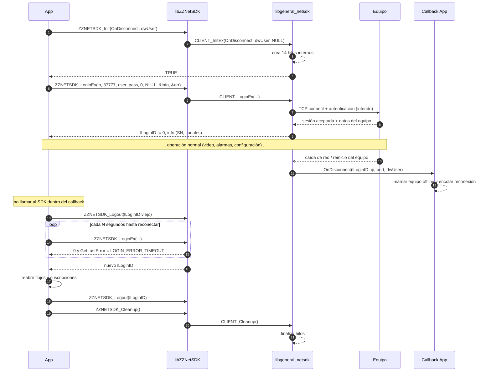

Puntos clave:

- El SDK **no reabre** automáticamente los flujos de la aplicación: tras la reconexión hay que volver a llamar `RealPlayEx`, `StartListenEx`, `RealLoadPictureEx`, etc.
- Tiempo medido de fallo de login contra un host inalcanzable: **~5 s** (`ZZNET_LOGIN_ERROR_TIMEOUT`, `0x80000066`).

---

## 5.2 Login con manejo de errores

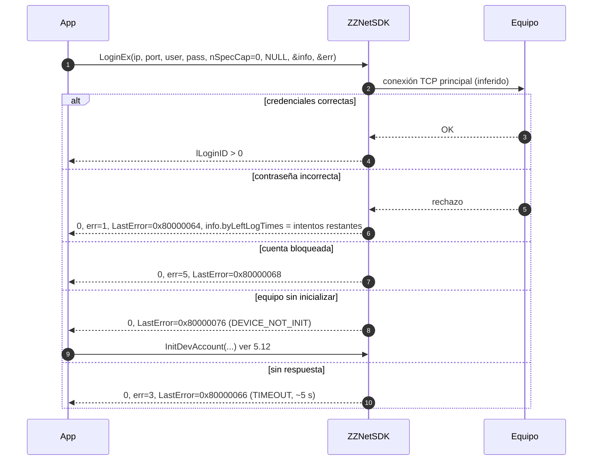

---

## 5.3 Video en vivo en servidor (sin ventana, por callback)

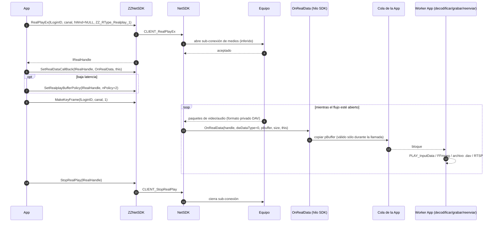

Notas:

- `dwDataType = 0` es el flujo original del equipo (contenedor privado Dahua, H.264/H.265 + audio). Para decodificarlo se puede usar `libplay.so` (`PLAY_OpenStream` → `PLAY_InputData` → `PLAY_SetDecodeCallBack` para obtener YUV) o un demuxer propio.
- Elegir explícitamente `rType`: el valor por defecto de la cabecera es `ZZ_RType_Multiplay` (mosaico), que no es lo habitual.

---

## 5.4 Búsqueda de grabaciones y reproducción por tiempo

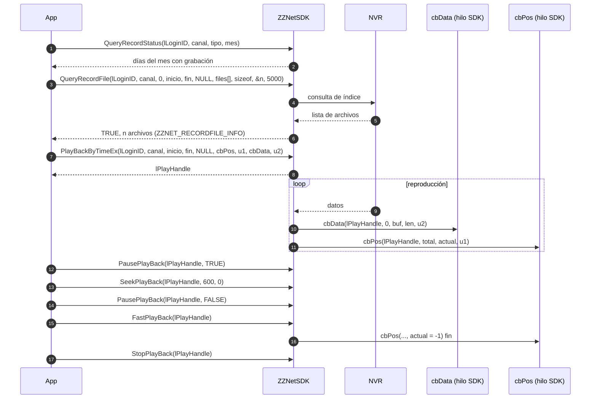

---

## 5.5 Descarga de grabaciones

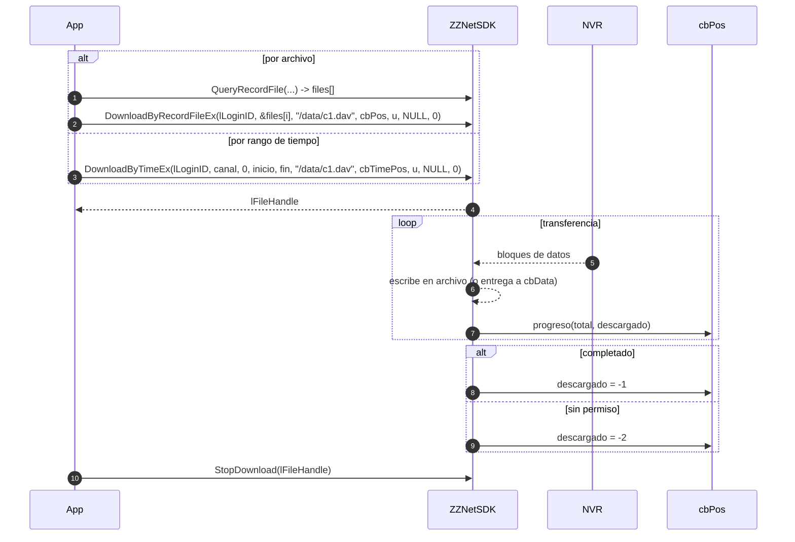

---

## 5.6 Suscripción a alarmas

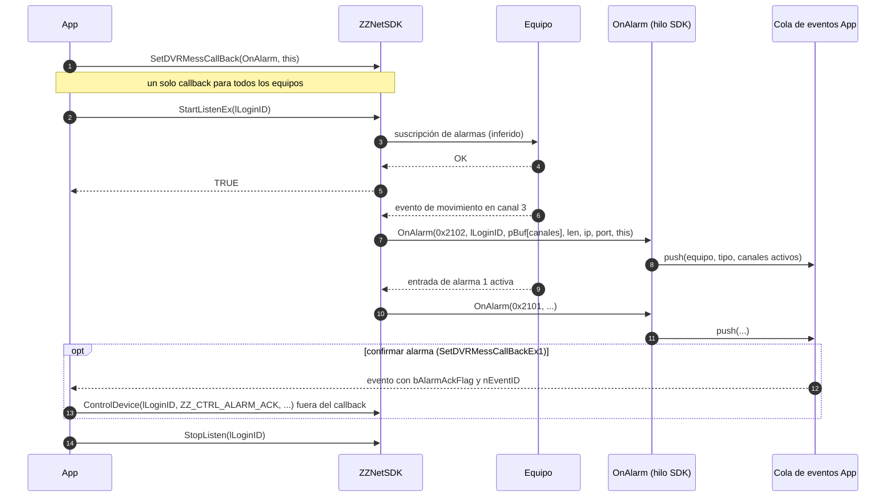

---

## 5.7 Eventos inteligentes (IVS) con imagen

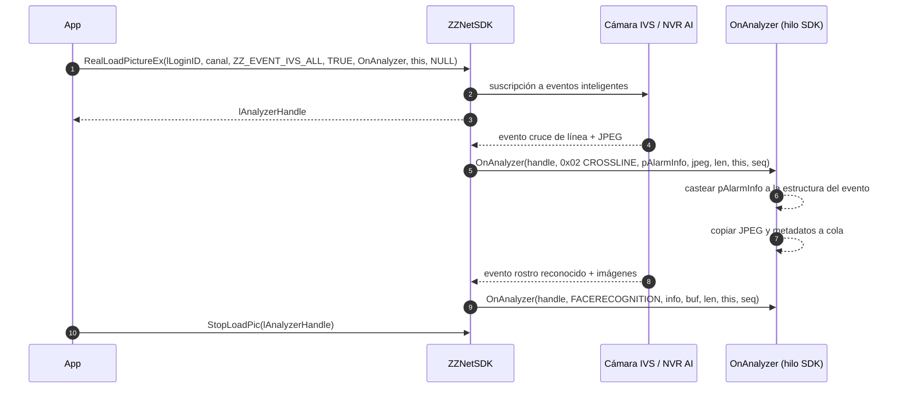

`nSequence` indica la posición de la imagen cuando un mismo evento trae varias (0 primera, 1 intermedia, 2 última, en la convención Dahua *(inferido)*).

---

## 5.8 Captura remota (snapshot del equipo)

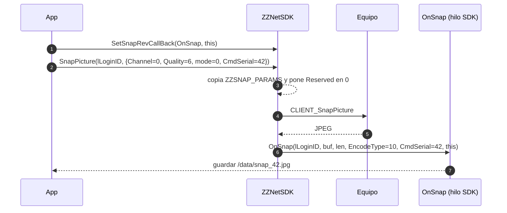

---

## 5.9 Control PTZ

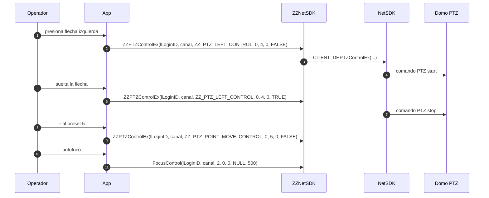

---

## 5.10 Registro activo (el equipo se conecta al servidor)

Útil cuando los equipos están detrás de NAT/CGNAT sin IP pública: el equipo se configura con la IP/puerto del servidor y abre la conexión hacia afuera.

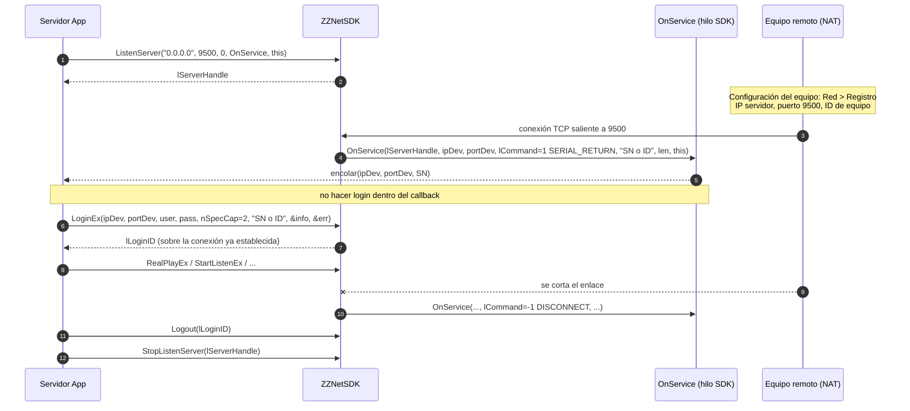

---

## 5.11 Login P2P

`nSpecCap = 19` (`EM_ZZ_LOGIN_SPEC_CAP_P2P`) está disponible en la API, con `pCapParam = NULL`. **El paquete no incluye una biblioteca de túnel P2P** (cliente de la nube P2P de Dahua). Pruebas realizadas:

- `LoginEx("127.0.0.1", 37777, ..., 19, NULL, ...)` → se comporta como un login TCP: intenta conectar a esa IP/puerto y falla por timeout (`0x80000066`).
- `LoginEx("<número de serie>", ..., 19, ...)` → también `0x80000066`: el NetSDK **no** resuelve números de serie por sí mismo.

Conclusión: en este SDK el modo P2P es un **login sobre un túnel ya establecido** por otro componente, que expone el equipo en una IP/puerto local. El NetSDK marca la sesión como P2P (ajusta keep-alive/tiempos y el uso de sub-conexiones) *(inferido)*. Flujo típico:

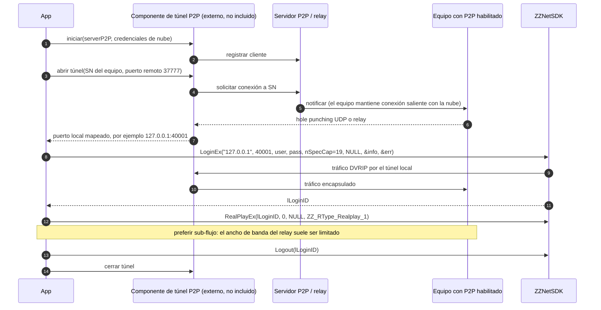

Alternativas cuando no se dispone de un componente P2P: **registro activo** (§5.10) o VPN.

---

## 5.12 Descubrimiento en LAN, cambio de IP e inicialización

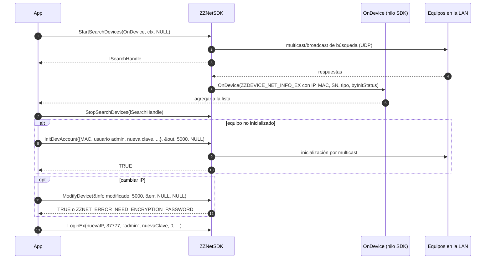

Se verificó que `StartSearchDevices` devuelve un handle válido y dispara la carga dinámica de `libavnetsdk.so`, `libdhconfigsdk.so` y `libcurl.so` (ver [03 §3.4](03-arquitectura.md)).

---

## 5.13 Lectura/escritura de configuración JSON

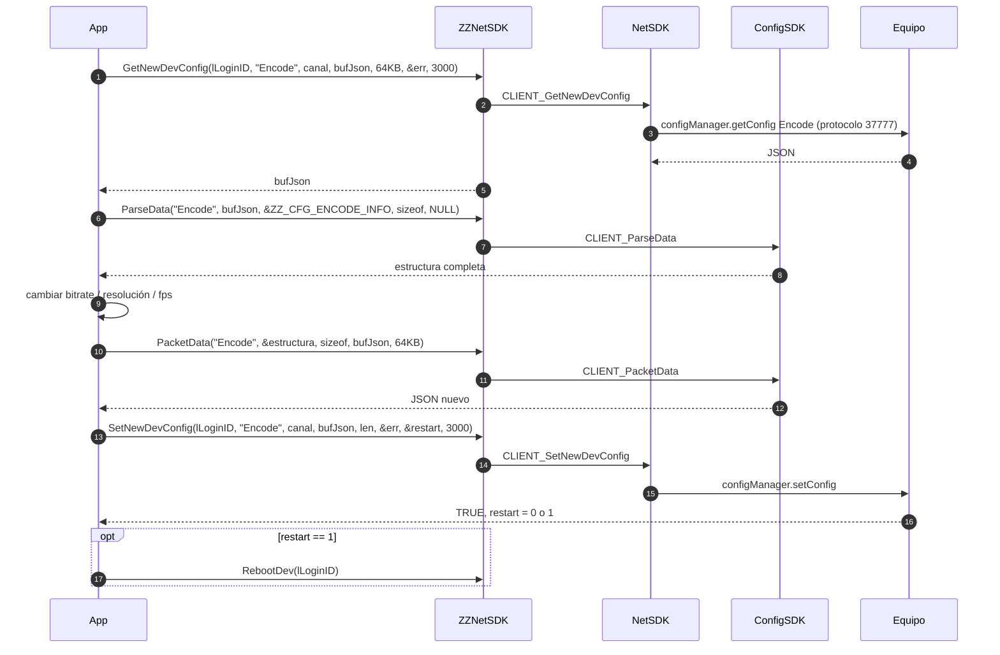

---

## 5.14 Exportación e importación de configuración (lógica propia ZZ, verificada)

Secuencias reconstruidas del desensamblado y **confirmadas** ejecutando el SDK contra un servidor HTTP que emula el CGI de Dahua (se registraron las peticiones reales).

### Exportación

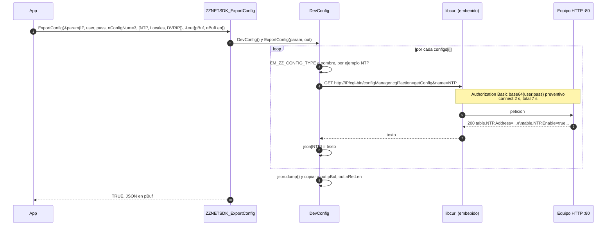

Peticiones capturadas:

```text
GET /cgi-bin/configManager.cgi?action=getConfig&name=NTP     AUTH=Basic YWRtaW46YWRtaW4xMjM=
GET /cgi-bin/configManager.cgi?action=getConfig&name=Locales AUTH=Basic YWRtaW46YWRtaW4xMjM=
GET /cgi-bin/configManager.cgi?action=getConfig&name=DVRIP   AUTH=Basic YWRtaW46YWRtaW4xMjM=
```

### Importación

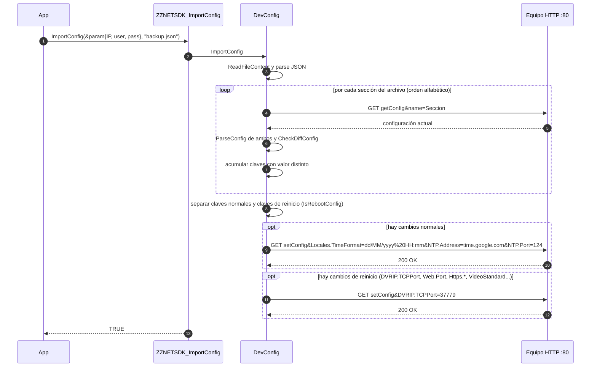

Peticiones capturadas (sólo se envían las diferencias; las claves iguales no viajan):

```text
GET /cgi-bin/configManager.cgi?action=getConfig&name=DVRIP
GET /cgi-bin/configManager.cgi?action=getConfig&name=Locales
GET /cgi-bin/configManager.cgi?action=getConfig&name=NTP
GET /cgi-bin/configManager.cgi?action=setConfig&NTP.Address=time.google.com
GET /cgi-bin/configManager.cgi?action=setConfig&DVRIP.TCPPort=37779        <- clave de reinicio, al final
```

---

## 5.15 Audio bidireccional (intercomunicador)

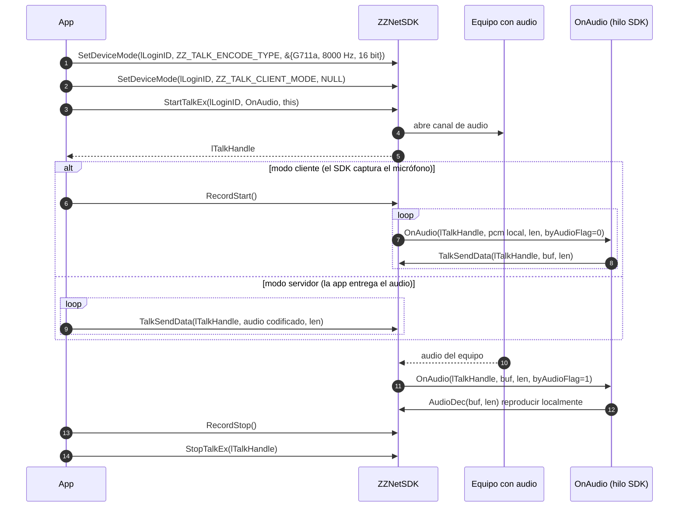

> Llamar `TalkSendData` desde el callback es el patrón clásico del NetSDK de Dahua para el modo cliente; es la única excepción habitual a la regla de "no llamar al SDK dentro de callbacks" *(inferido de la documentación general de Dahua)*.

---

## 5.16 Actualización de firmware

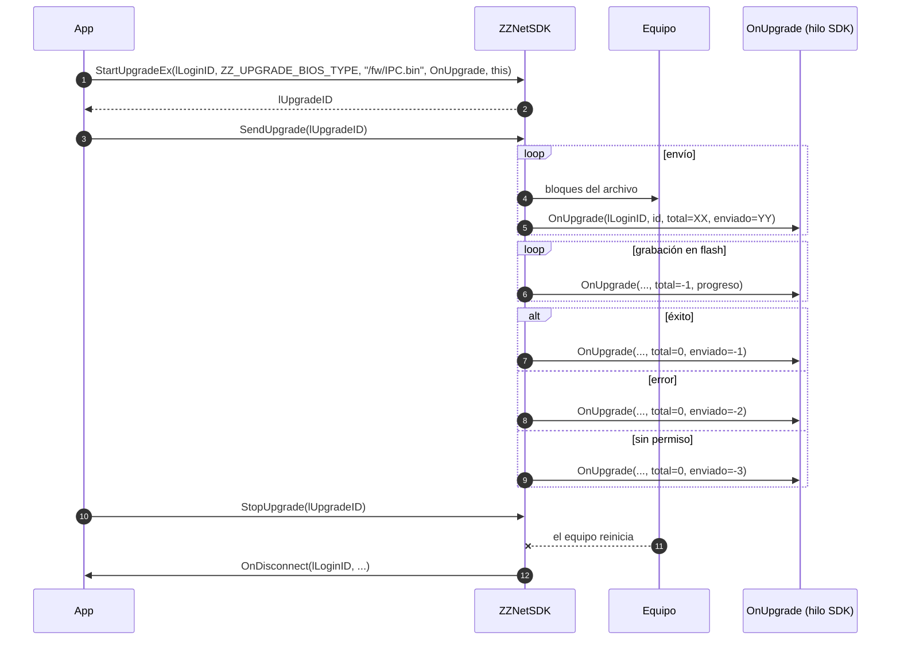
