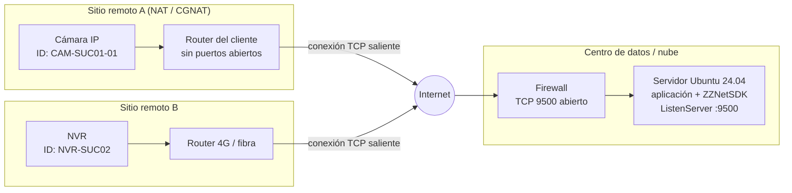
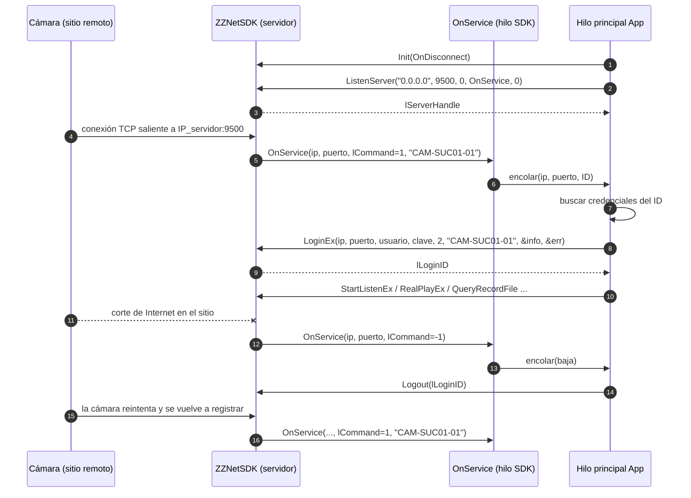

# 9. Guía: cámaras remotas por registro activo (Auto Register)

[← Índice](README.md)

Esta guía explica cómo conectar cámaras, NVR o XVR ubicados en **sitios remotos detrás de NAT** (sin IP pública, sin abrir puertos del lado del cliente) a un **servidor Linux** que ejecuta una aplicación basada en ZZNetSDK.

## 9.1 ¿P2P o registro activo?

| | P2P de Dahua (DMSS / Easy4ip) | **Registro activo (Auto Register)** |
|---|---|---|
| Quién inicia la conexión | Ambos lados contra la nube de Dahua | **La cámara**, hacia tu servidor |
| Servidores intermedios | Nube de Dahua (terceros) | Ninguno: conexión directa cámara → servidor |
| Requiere en el SDK | Biblioteca de túnel P2P (**no incluida**) | `ZZNETSDK_ListenServer` + `LoginEx(nSpecCap=2)` (**incluido**) |
| Puertos abiertos en el sitio de la cámara | No | **No** |
| Puertos abiertos en el servidor | No | **Sí**: 1 puerto TCP (por ejemplo 9500) |
| IP del servidor | — | Pública fija o dominio (DDNS) |
| Dependencia de terceros | Alta (disponibilidad/política de la nube) | Ninguna |

**Conclusión:** con este SDK, la forma soportada de conectar cámaras remotas es el **registro activo**. El login P2P (`nSpecCap=19`) sólo sirve si otro componente ya estableció un túnel (ver [05 §5.11](05-flujos-secuencia.md) y [08 §8.8](08-hallazgos-y-limitaciones.md)).

## 9.2 Topología



## 9.3 Requisitos

| Elemento | Requisito |
|---|---|
| Servidor | Ubuntu 24.04 con el SDK instalado ([02](02-instalacion-ubuntu.md)) |
| Dirección del servidor | IP pública fija, o un dominio (DDNS) que resuelva a ella |
| Puerto | Un puerto TCP libre en el servidor (en esta guía: **9500**) |
| Red del sitio remoto | Salida a Internet hacia `IP_servidor:9500/TCP` (casi siempre permitida por defecto) |
| Cámara / NVR | Firmware con la opción **Registro** (*Register / Auto Register*). Presente en la mayoría de los equipos Dahua y OEM |
| Credenciales | Usuario y clave de cada equipo (el registro no reemplaza el login) |
| ID único | Un identificador por equipo (se define en la cámara y lo conoce el servidor) |

## 9.4 Configuración de la cámara (o NVR)

Los nombres de menú pueden variar ligeramente según la versión de firmware e idioma.

1. Acceder a la interfaz web del equipo desde la red local del sitio (`http://IP_local_de_la_cámara`) con el usuario administrador.
2. Ir a **Configuración → Red → Registro** (en inglés: *Setup → Network → Register*).
3. Completar los campos:

   | Campo | Valor | Comentario |
   |---|---|---|
   | **Habilitar** | ✔ | Activa el registro activo |
   | **Dirección del servidor** / *Server Address* | `vms.miempresa.com` o `203.0.113.10` | IP pública o dominio del servidor Linux |
   | **Puerto** / *Port* | `9500` | Debe coincidir con el de `ListenServer` |
   | **ID de sub-dispositivo** / *Sub-Device ID* | `CAM-SUC01-01` | Único por equipo; el servidor lo recibe al registrarse y lo usa en el login |

4. **Guardar**. El equipo empezará a conectarse al servidor y reintentará automáticamente si la conexión se corta o el servidor no está disponible.
5. Recomendado en el mismo equipo:
   - **Hora**: configurar NTP (**Configuración → Sistema → Fecha y hora**), para que las grabaciones y eventos tengan hora correcta.
   - **Usuario dedicado**: crear un usuario para la plataforma con los permisos mínimos necesarios, en lugar de usar `admin`.
   - **Flujo secundario (sub-flujo)**: configurar resolución y bitrate moderados para la visualización remota (menos ancho de banda).
   - **DNS**: si se usa dominio, verificar que el equipo tenga DNS válidos (**Red → TCP/IP**).
6. En un **NVR**, el registro se configura una sola vez en el NVR; todas sus cámaras se ven como canales del mismo login.

> Referencias de configuración de la plataforma Dahua: menú *Setup → Network → Register* con campos habilitar, dirección del servidor, puerto (9500 es el habitual en plataformas) e ID de sub-dispositivo único ([DaxunView](https://daxunview.com/Reg-dahua.html), [Dahua Support](https://dahuatech.zendesk.com/hc/en-gb/articles/16175800156306-How-to-Auto-Register-IPC-to-NVR)).

## 9.5 Configuración del servidor

### Firewall

```bash
# UFW (Ubuntu)
sudo ufw allow 9500/tcp comment 'ZZNetSDK registro activo'
sudo ufw status

# Si el servidor está en la nube (AWS/Azure/GCP): abrir 9500/TCP también en el
# security group / NSG correspondiente.
```

Si el servidor está detrás de un router, redirigir (*port forwarding*) `9500/TCP` del router hacia la IP interna del servidor. Si es posible, restringir el acceso a las IPs de origen conocidas de los sitios.

### Verificar que la aplicación escucha

```bash
sudo ss -ltnp | grep 9500
# LISTEN 0 ... 0.0.0.0:9500 ... users:(("autoreg_server",pid=...))
```

### Verificar alcance desde un sitio remoto

Desde una PC en la red de la cámara:

```bash
nc -vz vms.miempresa.com 9500      # Linux/macOS
Test-NetConnection vms.miempresa.com -Port 9500   # Windows PowerShell
```

## 9.6 Flujo en la aplicación



Reglas importantes:

- **No llamar a `LoginEx` dentro de `OnService`**: encolar el evento y procesarlo en otro hilo.
- `nSpecCap = 2` (`EM_ZZ_LOGIN_SPEC_CAP_SERVER_CONN`) y `pCapParam` = **ID de sub-dispositivo** recibido.
- Usar la **IP y el puerto de origen** que informa el callback (son los de la conexión NAT del sitio), no la IP local de la cámara.
- Ante un nuevo registro del mismo ID, cerrar la sesión anterior antes de hacer login otra vez.
- Validar el ID contra una lista de equipos conocidos: cualquiera que alcance el puerto puede intentar registrarse.

## 9.7 Programa de ejemplo: `autoreg_server.cpp`

Compilado sin advertencias y **ejecutado** en Ubuntu 24.04: abre el puerto (verificado en estado `LISTEN` en `0.0.0.0:9500`) y se detiene limpiamente con Ctrl+C. El login real requiere una cámara configurada según §9.4.

```cpp
// Servidor de registro activo: espera que las cámaras remotas se conecten,
// hace login sobre la conexión entrante y suscribe alarmas.
#include <cstdio>
#include <cstring>
#include <cstdlib>
#include <csignal>
#include <map>
#include <mutex>
#include <queue>
#include <string>
#include <unistd.h>
#include "ZZNetSDK.h"

// Credenciales por ID de sub-dispositivo (en producción: base de datos / archivo seguro)
static const std::map<std::string, std::pair<std::string, std::string>> kCams = {
    {"CAM-SUC01-01", {"admin", "ClaveCam01!"}},
    {"CAM-SUC02-01", {"admin", "ClaveCam02!"}},
};

struct Registro { std::string ip; WORD port; std::string id; bool alta; };

static std::mutex g_mx;
static std::queue<Registro> g_cola;                 // eventos del callback -> hilo principal
static std::map<std::string, LLONG> g_sesiones;     // id -> lLoginID
static std::map<std::string, std::string> g_origen; // "ip:puerto" -> id
static volatile bool g_run = true;

// Callback del servidor: SOLO encola, no llama al SDK
static int CALLBACK OnService(LLONG hSrv, char* ip, WORD port, LONG cmd,
                              void* param, DWORD len, LDWORD) {
    Registro r{ip ? ip : "", port, "", false};
    if (cmd == ZZ_DVR_SERIAL_RETURN && param) {      // 1: el equipo se registró
        r.id.assign(static_cast<char*>(param), strnlen(static_cast<char*>(param), len));
        r.alta = true;
    } else if (cmd == ZZ_DVR_DISCONNECT) {           // -1: se cortó la conexión
        r.alta = false;
    } else {
        return 0;
    }
    std::lock_guard<std::mutex> lk(g_mx);
    g_cola.push(r);
    return 0;
}

static void CALLBACK OnDisconnect(LLONG login, char* ip, LONG port, LDWORD) {
    fprintf(stderr, "[desconexión] %s:%d login=%ld\n", ip, port, login);
}

static BOOL CALLBACK OnAlarm(LONG cmd, LLONG login, char*, DWORD len, char* ip, LONG, LDWORD) {
    printf("[alarma] %s cmd=0x%X len=%u\n", ip, (unsigned)cmd, len);
    return TRUE;
}

static void procesar(const Registro& r) {
    std::string clave = r.ip + ":" + std::to_string(r.port);
    if (!r.alta) {                                   // baja: cerrar la sesión asociada
        auto it = g_origen.find(clave);
        if (it != g_origen.end()) {
            auto s = g_sesiones.find(it->second);
            if (s != g_sesiones.end()) { ZZNETSDK_Logout(s->second); g_sesiones.erase(s); }
            printf("[baja] %s (%s)\n", it->second.c_str(), clave.c_str());
            g_origen.erase(it);
        }
        return;                                      // la cámara reintentará registrarse sola
    }
    auto cred = kCams.find(r.id);
    if (cred == kCams.end()) { printf("[rechazo] ID desconocido '%s' desde %s\n", r.id.c_str(), r.ip.c_str()); return; }

    auto prev = g_sesiones.find(r.id);               // re-registro: cerrar sesión anterior
    if (prev != g_sesiones.end()) { ZZNETSDK_Logout(prev->second); g_sesiones.erase(prev); }

    ZZNET_DEVICEINFO info{}; int err = 0;
    std::string id = r.id;                           // pCapParam = ID de sub-dispositivo
    LLONG login = ZZNETSDK_LoginEx(r.ip.c_str(), r.port,
                                   cred->second.first.c_str(), cred->second.second.c_str(),
                                   EM_ZZ_LOGIN_SPEC_CAP_SERVER_CONN, (void*)id.c_str(), &info, &err);
    if (!login) { printf("[login] %s falló err=%d 0x%08X\n", id.c_str(), err, ZZNETSDK_GetLastError()); return; }
    printf("[login] %s OK desde %s:%u SN=%s canales=%d\n", id.c_str(), r.ip.c_str(), r.port,
           (char*)info.sSerialNumber, info.byChanNum);
    g_sesiones[id] = login;
    g_origen[clave] = id;
    ZZNETSDK_StartListenEx(login);                   // ejemplo: suscribir alarmas
}

int main(int argc, char** argv) {
    WORD puerto = argc > 1 ? (WORD)atoi(argv[1]) : 9500;
    signal(SIGINT,  [](int){ g_run = false; });
    signal(SIGTERM, [](int){ g_run = false; });

    ZZNETSDK_Init(OnDisconnect, 0);
    ZZNETSDK_SetDVRMessCallBack(OnAlarm, 0);

    char ip[] = "0.0.0.0";
    LLONG srv = ZZNETSDK_ListenServer(ip, puerto, 0, OnService, 0);
    if (!srv) { printf("ListenServer falló 0x%08X\n", ZZNETSDK_GetLastError()); ZZNETSDK_Cleanup(); return 1; }
    printf("Esperando cámaras en TCP %u ...\n", puerto);

    while (g_run) {
        std::queue<Registro> q;
        { std::lock_guard<std::mutex> lk(g_mx); std::swap(q, g_cola); }
        while (!q.empty()) { procesar(q.front()); q.pop(); }
        usleep(200 * 1000);
    }

    for (auto& s : g_sesiones) { ZZNETSDK_StopListen(s.second); ZZNETSDK_Logout(s.second); }
    ZZNETSDK_StopListenServer(srv);
    ZZNETSDK_Cleanup();
    printf("Servidor detenido\n");
    return 0;
}
```

Compilación y ejecución:

```bash
g++ -std=c++17 -Wall autoreg_server.cpp -I/opt/zznetsdk/include \
    -L/opt/zznetsdk/lib_linux64 -lZZNetSDK -lgeneral_netsdk -lgeneral_configsdk \
    -lssl -lcrypto -lpsl -lpthread -o autoreg_server
./autoreg_server 9500
```

Salida esperada cuando una cámara se registra:

```text
Esperando cámaras en TCP 9500 ...
[login] CAM-SUC01-01 OK desde 181.x.x.x:51234 SN=7K0XXXXXXXXXXXX canales=1
[alarma] 181.x.x.x cmd=0x2102 len=1
```

Para ejecutarlo como servicio, usar el unit de systemd de [02 §2.8](02-instalacion-ubuntu.md#28-ejecutar-como-servicio-systemd).

> **¿Y RTSP?** El registro activo no expone el RTSP nativo de la cámara. Para publicar las cámaras registradas como `rtsp://servidor:8554/<ID>` ver [10-pasarela-rtsp.md](10-pasarela-rtsp.md).

## 9.8 Ancho de banda y rendimiento

| Recomendación | Motivo |
|---|---|
| Usar **sub-flujo** (`ZZ_RType_Realplay_1`) para ver en vivo | El enlace de subida del sitio suele ser el cuello de botella |
| Descargar grabaciones fuera de horario pico | Evita saturar el enlace del cliente |
| Medir la subida del sitio (por ejemplo 2-5 Mbps en ADSL/4G) | Un flujo principal 4MP H.265 puede requerir 2-4 Mbps |
| `SetRealplayBufferPolicy(..., nPolicy=1)` (fluidez) en enlaces inestables | Absorbe variaciones de latencia |

## 9.9 Seguridad

- El protocolo privado de Dahua viaja **sin cifrado de transporte garantizado**. Para tráfico por Internet evaluar:
  - **VPN** (WireGuard/IPsec) entre sitios y servidor; o
  - restringir el puerto 9500 a las IPs de origen conocidas.
- Usar **usuarios dedicados** con clave fuerte por equipo; no reutilizar la clave de `admin`.
- **Validar el ID** recibido antes de hacer login (el ejemplo rechaza IDs desconocidos).
- **No** usar `ExportConfig`/`ImportConfig` a través de Internet: envían la clave en claro por HTTP ([08 §8.5](08-hallazgos-y-limitaciones.md)).
- Mantener el firmware de las cámaras actualizado.

## 9.10 Resolución de problemas

| Síntoma | Causa probable | Qué revisar |
|---|---|---|
| El callback nunca se dispara | La cámara no llega al servidor | `nc -vz servidor 9500` desde el sitio; firewall/NSG; port forwarding; dominio/DNS en la cámara |
| El callback se dispara, pero el login falla con `0x80000064` / `err=1` | Clave incorrecta | Credenciales del ID en el servidor |
| Login falla con `0x80000066` (timeout) | Se usó la IP local de la cámara o un puerto incorrecto | Usar la IP/puerto que entrega `OnService` |
| Login falla con `0x80000004` o parámetro inválido | `nSpecCap` o ID incorrecto | `nSpecCap = 2` y `pCapParam` = ID exacto recibido |
| El equipo se registra y se cae cada pocos minutos | Enlace inestable o NAT que corta conexiones inactivas | Calidad del enlace; keep-alive del router del sitio |
| Aparece un ID que no configuraste | Otro equipo (o un escaneo) llegó al puerto | Restringir el puerto por IP; validar IDs |
| Video en vivo se corta o no arranca | Ancho de banda insuficiente | Usar sub-flujo; revisar la subida del sitio |

## 9.11 Lista de verificación

- [ ] Servidor con IP pública o dominio, puerto 9500/TCP abierto (UFW + nube + router).
- [ ] Aplicación ejecutando `ListenServer` en 9500 (`ss -ltnp`).
- [ ] Cámara: registro habilitado, dirección del servidor, puerto 9500 e ID único.
- [ ] Cámara: NTP, DNS, usuario dedicado, sub-flujo configurados.
- [ ] Servidor: tabla ID → credenciales cargada.
- [ ] Prueba de alcance desde el sitio (`nc` / `Test-NetConnection`).
- [ ] Verificar login, video en vivo por sub-flujo y alarmas.
- [ ] Probar la reconexión: desconectar el Internet del sitio y confirmar que la cámara se vuelve a registrar.
